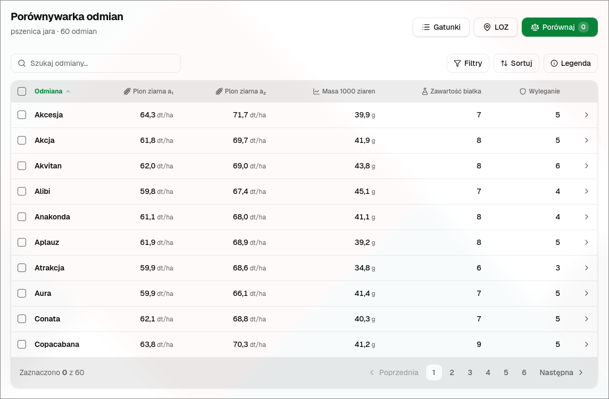
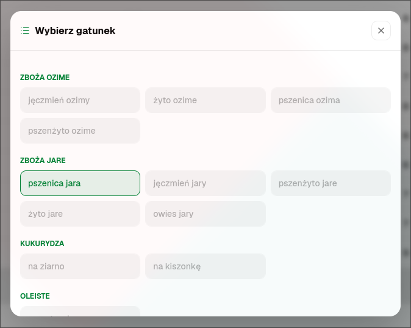
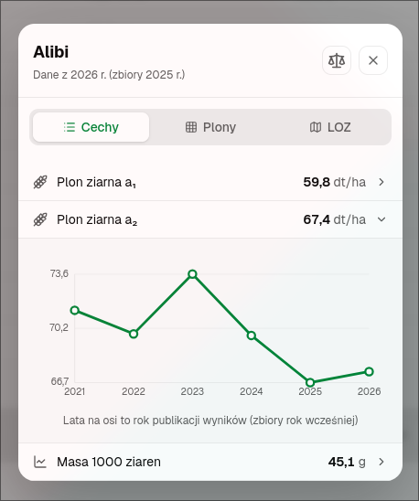
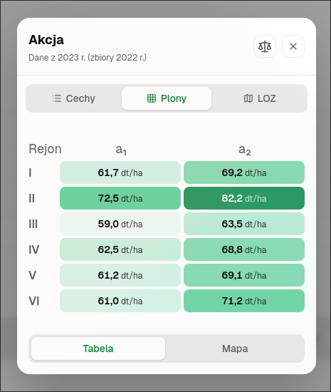
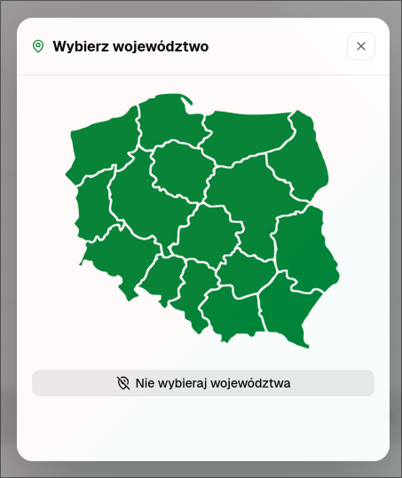
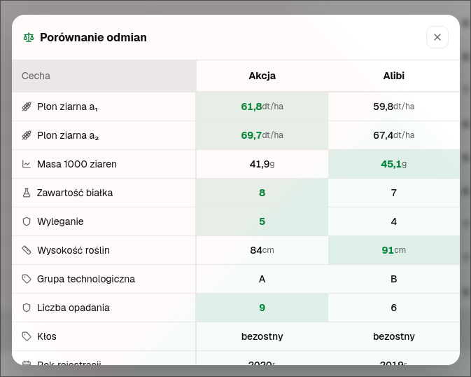

# Crop Variety Comparison Tool

A web app for comparing crop varieties, built for [topagrar.pl](https://www.topagrar.pl/). It uses data from [COBORU](https://coboru.gov.pl/). Browse varieties of a species, filter them by the Recommended Varieties List, for a region and year, and compare varieties side by side.



## Requirements

- [Bun](https://bun.sh/)

A Nix flake (`flake.nix`) is also provided for a reproducible environment with Bun and Node.js:

```sh
nix develop
```

## Features

- **Species** (`Gatunki`) – pick a species, grouped into categories.
- **Variety table** – search by name, sort by any trait, and filter by year or by label.
- **LOZ** – pick a voivodeship on a map of Poland to show only the varieties on its Recommended Varieties List.
- **Variety details** – all traits with a chart of how each one changed over the years, yields by region as a table and a map of the voivodeships where the variety is recommended.
- **Compare** (`Porównaj`) – compare the selected varieties side by side, with the best value of each trait highlighted.
- **Accessibility** – ARIA labels, semantic table markup and keyboard navigation.

### Species selection

Species are grouped by category. Species without data yet are greyed out.



### Variety traits

The `Cechy` tab lists every trait of a variety. Expanding a trait shows a chart of its values over the years.



### Yields by region

The `Plony` tab shows yields in each meta-region as a heatmap.



### LOZ voivodeship selection

Clicking a voivodeship leaves only the varieties on its Recommended Varieties List. `Nie wybieraj województwa` clears the filter.



### Variety comparison

Selected varieties are shown side by side, with the best value of each trait highlighted in green.



## Data

The data comes from COBORU's. It is stored as static JSON in `public/data/` and fetched at runtime:

- `species.json` – the list of species and categories. `dataFile` points to a species' dataset, or is `null` when there is no data yet.
- `<species>.json` – one dataset per species, made of two parts:
  - `schema` – trait definitions (name, unit, type and icon), split into `primary_traits` (the table columns), `secondary_traits` (shown in the details), `regional_yields` and `recommended_regions`.
  - `odmiany` – the varieties. Each variety has its trait values for every year.

Adding a species only needs its JSON file in `public/data/` and its `dataFile` set in `species.json`. The table, filters and details are built from the dataset's `schema`.

## File structure

- `src/App.tsx` – the main view: header, table, pagination and filtering/sorting of the rows.
- `src/hooks/useAction.ts` – app state and actions (a reducer).
- `src/utils/loadData.ts` – data types, fetching and caching of the datasets.
- `src/components/` – the variety table, toolbar, trait chart, regional yields heatmap and maps of Poland.
- `src/modals/` – dialogs for species, LOZ region, filters, sorting, legend, variety details and comparison.
- `src/ui/` – shadcn/ui components.
- `public/data/` – the datasets.
